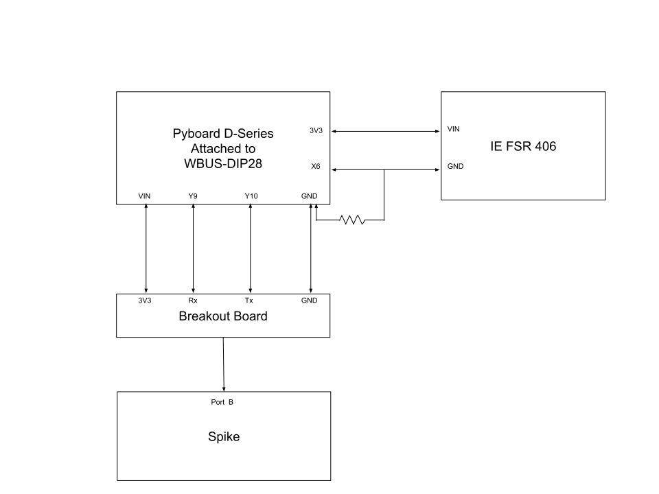

# SPIKE-Pyboard FSR

We displayed the readings of a force sensor on a SPIKE using a Pyboard. The SPIKE scrolls through displayed output when it is longer than one character. So, we clamped the range of the force sensor (which we think is 0-5000 mV) to 0-9 for easier SPIKE displaying.

